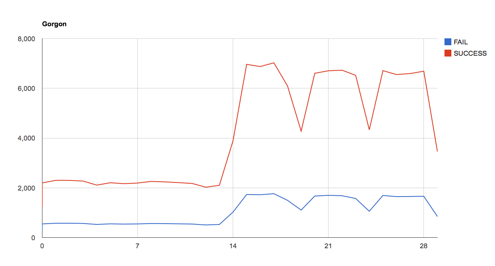

Gorgon
======

Gorgon. A simple multiplier task analysis tool in Python

Gorgon is a framework to repeat a Python function N times, using multiprocessing and multithread to multiply the use.
A report is presented then to show the results and time on the calls, in an aggregated manner.

Gorgon started aiming to allow easy creation of relatively high loads of complex HTTP loadtests. Typically, loadtest tools like 
Tsung or ab doesn't allow a lot of control over the returning values or flow control (send this request to create an object,
use the object id to do another request)
In this regard, Gorgon aspired to be an intermediate tool between creating system tests and pure loadtesting.

Then the aimed changed to be more a multiplier of a Python function, and collect stats, allowing to use any kind of task, HTTP or not.

Basic usage
===========

  Create the function that you want to run. This should accept a single parameter that will be a unique number.

    def operation_http(number):
        result = requests.get('http://localhost')
        return result.status_code

  Then create a Gorgon with that operation and generate one or more runs. Each run will run the function `num_operations` times.

        NUM_OPS = 4000
        test = Gorgon(operation_http)
        test.go(num_operations=NUM_OPS, num_processes=1, num_threads=1)
        test.go(num_operations=NUM_OPS, num_processes=2, num_threads=1)
        test.go(num_operations=NUM_OPS, num_processes=2, num_threads=4)
        test.go(num_operations=NUM_OPS, num_processes=4, num_threads=10)

  You can get the results of the whole suite with `small_report` (simple aggregated results) or with `html_report` (graphs).

    Printing small_report result
    Total time:  31s  226ms
    Result      16000      512 ops/sec. Avg time:  725ms Max:  3s  621ms Min:   2ms
       200      16000      512 ops/sec. Avg time:  725ms Max:  3s  621ms Min:   2ms

  Example of graphs. Just print the result of `html_report` as HTML and take a look with a browser (it uses [Google Chart API](https://developers.google.com/chart/))

  

More
========

This is extremelly early days, but a wishlist/roadmap/comments:

  - Good enough performance
  - Easy to use and integrate. A full (simple) test should be possible in less than 20 lines
  - Allow a test mode to check that all the calls are working as expected and debug.
  - Use multithread/multiprocess
    - Debug mode should not do this to allow easy debug.
  - Create an example/tool to read HTTP calls from a file as input
  - Good documentation
    - Give a couple of good examples on how to use it
    - Someone with a good knowledge of an API should be able to create a working script in 30 minutes
  - Good reporting
    - Interactive reporting (progress bar and stats).
    - Allow partial reporting (in case a test is too long)
    - Better graphs
  - Advanced feature. Use fabric (or other module) to work in multiple boxes environment
  - The main development language is Python3 (hey, we are in 2015 after all), but, if easy possible, should be Python2 compatible. At the moment, it is
